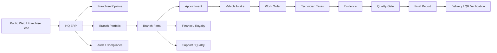
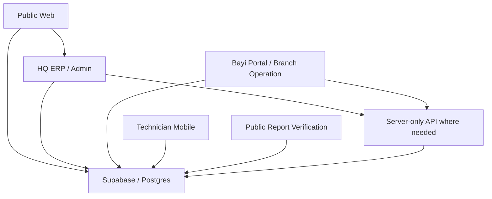
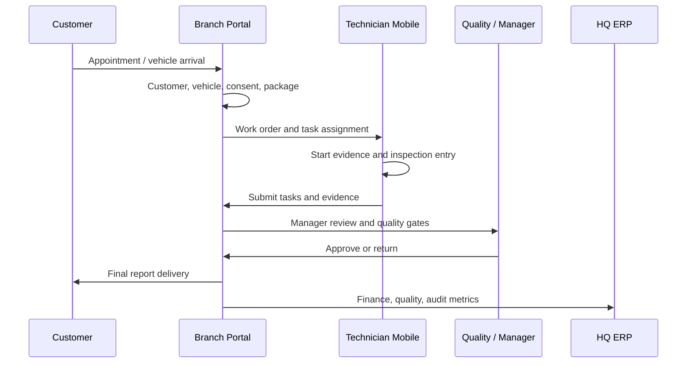

# OTOTR ERP Operations - First 20 Step Execution Report

Date: 2026-06-03
Scope: Thread 14 - OTOTR ERP / Tum Operasyon Yonetimi

This report turns the first 20 ERP operations actions into a concrete baseline for the existing OTOTR system. It is based on the current master workspace, not on a generic ERP template.

## Source Evidence Used

| Area | Current source |
| --- | --- |
| Product rules | `docs/business-rules.md`, `docs/franchise-model.md` |
| Architecture | `docs/architecture.md`, `NEXT_PHASES.md` |
| Auth and scope | `docs/auth-and-roles.md` |
| Database | `docs/database.md`, `docs/database-migration-inventory.md`, `packages/database/raw-migrations` |
| Admin ERP prototype | `apps/admin/prototype/index.html`, `apps/admin/prototype/src` |
| Branch portal prototype | `apps/admin/prototype/bayi-portal/index.html` |
| Flutter branch app | `apps/mobile-branch/lib` |
| Technician app | `apps/mobile-technician/src/live` |
| Tests and known blockers | `TEST_RESULTS.md`, `MIGRATION_LOG.md` |

## Executive Visual



## Step Completion Board

| # | Step | Current ERP fit | Execution output | Next implementation action |
| ---: | --- | --- | --- | --- |
| 1 | Repo and source control | Current root is `OTOTR-FRANCHISE-MASTER`; old folders are reference only. | Repo boundary confirmed; old files remain untouched. | Snapshot/commit strategy should be decided before code refactor. |
| 2 | ERP module map | Existing surfaces already split into admin, branch, technician, public web and database. | Module map below created. | Convert map into navigation and package boundaries. |
| 3 | Role and permission matrix | Role model exists in docs, demo data and RLS direction. | Role matrix below created. | Add role constants to shared package when implementation starts. |
| 4 | Main operation flow | Existing business rules and Flutter work order gates define the flow. | End-to-end operation flow below created. | Use it as the contract for branch portal and mobile screens. |
| 5 | Work order data model | Flutter `WorkOrder` includes tasks, modules, evidence, report and delivery gates. | Canonical work order contract summarized below. | Align Supabase tables and admin prototype fields to this contract. |
| 6 | Branch operation dashboard scope | Branch portal prototype and admin demo contain KPI/risk signals. | Branch dashboard KPI set defined. | Bind prototype widgets to live branch-scoped contracts. |
| 7 | HQ ERP dashboard scope | Admin prototype has CEO cockpit, finance, quality, operations and alerts. | HQ cockpit scope defined. | Split large admin prototype into maintainable modules. |
| 8 | Resource and capacity model | Branch capacity is present as a concept, but exact scheduling model is not frozen. | Capacity object model defined. | Add branch working hours, lifts, technician calendars and package durations. |
| 9 | Task assignment rule | Technician task ownership and RPC signals exist. | Assignment rule defined. | Implement skill/capacity/priority based assignment policy. |
| 10 | Appointment to work order rule | Dealer API model has appointment conversion. | State transition rules defined. | Connect appointment conversion to work order creation and audit. |
| 11 | Quality gates | Business rules and Flutter `reportPrintGateReady` already define gates. | Quality gate checklist defined. | Use the same checklist in admin, branch and technician views. |
| 12 | Finance and royalty rules | Demo data and legal module contain royalty/payment signals. | Finance operation rules defined. | Create canonical finance transaction and royalty status screens. |
| 13 | Franchise sales pipeline | Franchise lifecycle is documented. | Pipeline stages and gates defined. | Map admin CRM records to application stages and approvals. |
| 14 | Branch opening project | Opening gates are documented. | Opening checklist model defined. | Create branch opening project board. |
| 15 | API contract draft | API direction exists; no production API finalized. | Domain API list below created. | Formalize endpoints before app refactors depend on them. |
| 16 | Database migration safety split | Raw migrations already grouped into schema, RLS, RPC and manual-only. | Safety split confirmed. | Keep demo/cleanup/manual-only out of production chain. |
| 17 | Demo vs production boundary | Existing rules warn against mixing demo/seed/cleanup with production. | Boundary rules defined. | Tag every data source as demo, staging or production. |
| 18 | Admin prototype refactor plan | Large `index.html` is preserved and smoke tests exist. | Refactor stages defined. | Extract services/data first, then pages, then UI. |
| 19 | Test matrix | Test commands and latest results exist. | ERP test matrix below created. | Run relevant tests after each touched surface. |
| 20 | MVP delivery scope | Existing MVP list exists in architecture and next phases. | MVP scope locked for ERP operations. | Build MVP in vertical slices from lead to report delivery. |

## 2. ERP Module Map



Primary modules:

| Surface | Modules |
| --- | --- |
| HQ ERP | CEO cockpit, franchise pipeline, branch portfolio, finance/royalty, quality/crisis, audit, support, academy |
| Branch portal | Daily cockpit, appointments, vehicle intake, work orders, technician task planning, manager approval, delivery, cashbox, support |
| Technician mobile | Assigned work orders, task modules, evidence capture, body inspection answers, final review |
| Public web | Appointment requests, franchise applications, complaints, branch list |
| Report verification | Public report lookup, QR/verify code, safe report output |

## 3. Role And Permission Matrix

| Role | Scope | Can do | Must not do |
| --- | --- | --- | --- |
| CEO / HQ | Global | Network KPIs, all branches, finance, quality, audit | Bypass audit trails |
| Admin | Global configured scope | Manage ERP records and operational oversight | Use service role from client |
| Region manager | Assigned regions | See regional branches and alerts | See unrelated regions |
| Franchise manager | Franchise pipeline | Leads, applications, opening projects | Change final report data |
| Branch owner | Own branch | Branch finance, staff, operations overview | See other branches |
| Branch manager | Own branch | Work orders, approvals, task assignment | Approve without required gates |
| Technician | Assigned tasks | Task entry, evidence, technical notes | See unrelated tasks or finance |
| Finance | Finance scope | Payments, royalty, cashbox, disputes | Edit technical report findings |
| Quality | Quality scope | Gate review, audit findings, complaint risk | Change payment records without finance |
| Support | Ticket scope | Support cases and follow-up | Access private finance unless assigned |
| Customer/public | Verified report only | View verified output | Access internal operational data |

## 4. Main Operation Flow



Canonical statuses:

1. Appointment created
2. Customer arrived
3. Vehicle accepted
4. Work order opened
5. Technician assigned
6. Start evidence required/complete
7. Inspection in progress
8. Evidence missing or submitted
9. Manager review
10. Quality approved or returned
11. Report gate ready
12. Payment and handover complete
13. Delivered or cancelled

## 5. Work Order Contract

Existing Flutter model already gives a strong baseline:

| Field family | Required contract |
| --- | --- |
| Identity | `id`, `number`, `expertise_case_id`, `work_order_no` |
| Customer and vehicle | Customer, plate, VIN, brand, model, mileage |
| Package | Package plan, package type, estimated duration |
| Assignment | Assigned technician, required task list |
| Technical data | Inspection modules, item values, risky findings |
| Evidence | Required photos/files, start evidence, quality status |
| Gates | Appointment, intake, consent, package, assignment, start evidence, external query, quality, payment, handover |
| Audit | Created time, audit logs, revisions, edit request state |

## 6. Branch Operation Dashboard Scope

| Widget | Purpose |
| --- | --- |
| Today appointments | Demand and arrival control |
| Open work orders | Daily workload |
| Technician load | Assignment and bottleneck control |
| Missing evidence | Prevent report gate failures |
| Waiting manager approval | Manager queue |
| Payment/cashbox state | Delivery readiness |
| Delayed jobs | SLA risk |
| Quality/complaint alerts | Branch risk |
| Support tickets | HQ escalation |
| Academy/staff readiness | Operational compliance |

## 7. HQ ERP Dashboard Scope

| Widget | Purpose |
| --- | --- |
| Network revenue | Overall commercial health |
| Royalty health | Franchise finance discipline |
| Branch ranking | Performance comparison |
| Risk branches | Quality/finance/legal early warning |
| Franchise funnel | Expansion pipeline |
| Opening projects | New branch launch readiness |
| Customer experience | Complaint and review signals |
| Quality score | Report trust and audit health |
| Support backlog | Network operations pressure |
| Audit history | Compliance and traceability |

## 8. Resource And Capacity Model

| Entity | Fields to track |
| --- | --- |
| Branch capacity | Working hours, lift count, bay count, daily slot capacity |
| Technician capacity | Role, skill set, shift, current load, active tasks |
| Package duration | Standard minutes, required modules, required evidence |
| Appointment slot | Start/end, source, expected package, assigned branch |
| Work order duration | Opened, started, submitted, approved, delivered |
| Bottleneck | Waiting status, owner, age, SLA risk |

Capacity formula baseline:

```text
daily_capacity_minutes = active_lifts_or_bays * working_minutes_per_day
technician_capacity_minutes = sum(active_technician_shift_minutes)
package_load_minutes = sum(package_duration_minutes for scheduled jobs)
capacity_risk = package_load_minutes / min(daily_capacity_minutes, technician_capacity_minutes)
```

## 9. Task Assignment Rule

Assignment order:

1. Confirm branch scope and work order state.
2. Expand package into required task modules.
3. Filter technicians by branch, role and skill.
4. Prefer lowest active load.
5. Raise priority for waiting customer, SLA risk, manager return or high-value package.
6. Lock assignment in audit log.
7. Allow manager override with reason.

## 10. Appointment To Work Order Rule

| Event | Result |
| --- | --- |
| Appointment created | Calendar slot reserved |
| Customer confirmed | Work order draft can be prepared |
| Customer arrived | Intake can start |
| Vehicle accepted | Work order can be opened |
| No-show | Slot released and lead follow-up opened |
| Cancelled | Audit event and optional reschedule |
| Converted | Appointment links to work order/expertise case |

## 11. Quality Gate Checklist

| Gate | Blocks report if missing |
| --- | --- |
| Vehicle identity | VIN, plate, motor number or work order mismatch |
| Consent and scope | KVKK, report scope, road test consent missing |
| Required evidence | Required photo/video/device output missing |
| Technical completion | Required modules incomplete |
| High-risk finding | Second control missing where required |
| External query | Required source query missing/pending |
| Legal language | Unsafe report language unresolved |
| Manager quality approval | Manager approval missing |
| Payment and handover | Delivery blocked when finance/handover incomplete |

## 12. Finance And Royalty Operation Rules

| Rule | Description |
| --- | --- |
| Work order revenue | Every paid package links to branch and work order |
| Cashbox state | Paid, unpaid, refund, invoice, dispute |
| Royalty basis | Royalty calculated from eligible package revenue |
| Delay alert | Late royalty or blocked payment creates HQ alert |
| Dispute flow | Branch can open royalty/payment dispute with evidence |
| Delivery check | Report delivery can require payment readiness |
| Audit | Finance changes require user, time and reason |

## 13. Franchise Sales Pipeline

```mermaid
flowchart LR
  Lead["Lead"] --> Score["Candidate Score"]
  Score --> Application["Application"]
  Application --> Feasibility["Location / Feasibility"]
  Feasibility --> Finance["Finance Approval"]
  Finance --> Legal["Legal / Contract"]
  Legal --> Academy["Academy Assignment"]
  Academy --> Opening["Branch Opening Project"]
  Opening --> Live["Branch Live"]
```



Gates:

| Stage | Required gate |
| --- | --- |
| Lead | Contact and consent |
| Application | Candidate identity and investment profile |
| Feasibility | Complete location data |
| Finance | Budget/approval or finance review |
| Legal | Contract approval |
| Academy | Required training assignment |
| Opening | Equipment, staff, quality audit and permissions |

## 14. Branch Opening Project Model

| Track | Checklist examples |
| --- | --- |
| Facility | Signage, architecture, camera, internet |
| Equipment | Lifts, measuring devices, calibration, consumables |
| People | Owner, manager, technicians, cashier, support contacts |
| Academy | Course enrollment, certificates, launch training |
| Finance | POS, cashbox, e-invoice, royalty setup |
| Digital | Google Business, branch profile, portal users |
| Quality | Pre-opening audit, findings, go-live approval |

## 15. API Contract Draft

| Domain | Contract need |
| --- | --- |
| Auth/session | Current user, role, branch/region scope |
| Branches | Branch card, capacity, staff, assets |
| Appointments | Create, confirm, cancel, convert to work order |
| Work orders | List, create, assign, status transitions |
| Technician tasks | Claim, submit, return, evidence |
| Reports | Template, answers, final report, revisions, delivery |
| Finance | Payments, cashbox, royalty, disputes |
| Quality | Gates, audits, findings, complaints |
| Franchise | Leads, applications, opening projects |
| Support | Tickets, messages, escalation |
| Public | Branches, appointments, franchise application, complaint, report verification |

Rule: service-role, payment, report generation, SMS/WhatsApp and external integrations must go through server-only routes.

## 16. Database Migration Safety Split

| Group | Current location | Production rule |
| --- | --- | --- |
| Schema foundations | `packages/database/raw-migrations/schema-foundations` | Review and order before use |
| RLS/security | `packages/database/raw-migrations/rls-security` | Requires role matrix tests |
| RPC/functions | `packages/database/raw-migrations/rpc-functions` | Requires contract and permission tests |
| Manual-only | `packages/database/raw-migrations/manual-only` | Never automatic production chain |
| Seeds/raw schemas | `packages/database/raw-schemas` | Staging/local only unless reviewed |

## 17. Demo Vs Production Boundary

| Data type | Allowed use |
| --- | --- |
| Admin mock/localStorage data | Prototype and smoke tests only |
| Demo seed SQL | Local/staging only after review |
| Cleanup SQL | Manual-only, never automatic production |
| Public staging data | QA and preview only |
| Production records | Only through approved live contracts and RLS |

## 18. Admin Prototype Refactor Plan

Safe order:

1. Keep `apps/admin/prototype/index.html` as the preserved working source.
2. Keep existing smoke tests green before every refactor.
3. Extract demo data and service logic first.
4. Extract page modules by ERP domain.
5. Extract shared UI components after behavior is stable.
6. Only then decide React/Next.js migration path.

Do not start with visual redesign. The risk is losing working ERP behavior hidden inside the large prototype.

## 19. Test Matrix

| Surface | Command / check | When |
| --- | --- | --- |
| Admin prototype | `node tools/test-demo-data.mjs` | data/service change |
| Admin prototype | `node tools/test-vin-service.mjs` | VIN/service change |
| Admin prototype | `node tools/test-index.mjs` | prototype behavior change |
| Flutter branch | `flutter analyze` via `C:\ototr_master` | Dart code change |
| Flutter branch | `flutter test` via `C:\ototr_master` | Dart logic/UI change |
| Expo technician | `npm.cmd run typecheck` | TS/React Native change |
| Database | metadata verification SQL | migration draft |
| RLS | role matrix smoke | before staging/prod |
| Public web | live/staging form smoke | public endpoint change |
| Visual QA | desktop/mobile screenshots | UI change |

## 20. MVP Scope Lock

Initial ERP operations MVP:

| Priority | Scope |
| --- | --- |
| P0 | CEO cockpit |
| P0 | CRM lead records |
| P0 | Appointment management |
| P0 | Work order lifecycle |
| P0 | Branch card and branch daily cockpit |
| P0 | Technician task and evidence flow |
| P0 | Quality gate and manager approval |
| P1 | Franchise sales funnel |
| P1 | Finance/royalty tracking |
| P1 | Audit history |
| P1 | Support/quality alerts |

## After The First 20

| Phase | Work |
| --- | --- |
| 21-25 | Formal API contracts, shared role constants, branch capacity schema, appointment conversion implementation, work order contract alignment |
| 26-30 | Admin module extraction, branch portal live data binding, technician task integration, quality gate enforcement, finance/royalty screen |
| 31-35 | Reviewed database migration chain, RLS role tests, local/staging validation, seed strategy, release/rollback checklist |
| 36-40 | MVP demo build, visual QA, end-to-end smoke, security review, first controlled release candidate |

## Risks And Controls

| Risk | Control |
| --- | --- |
| Large admin prototype hides behavior | Refactor service/data first; keep smoke tests |
| Demo data leaks into production thinking | Mark every source as demo/staging/production |
| RLS gap exposes branch data | Role matrix and RLS smoke tests before live |
| Database migrations are not executable chain yet | Keep raw/manual-only separated |
| Mobile apps diverge from ERP contract | Work order and task contract must be shared |
| Docker/WSL local DB blocker | Continue static review; rerun local validation after environment is fixed |

## Deliverable Links

- Visual report: `docs/erp-operations-visual-report.html`
- This execution report: `docs/erp-operations-20-step-execution.md`
